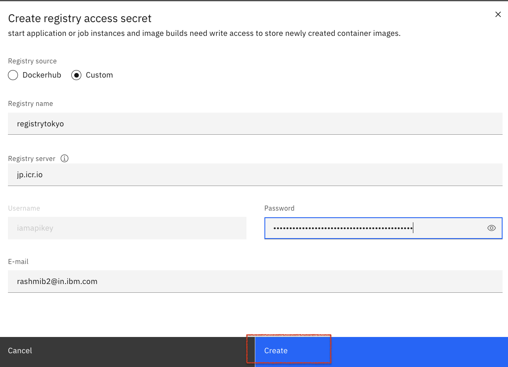

Under contruction

https://cloud.ibm.com/docs/codeengine?topic=codeengine-run-job-tutorial

https://cloud.ibm.com/docs/codeengine?topic=codeengine-run-job-tutorial


# Troubleshooting the IBM Cloud Code Engine batch job 

Jobs are designed to run one time and exit.


# Architecture

1. Building the container image based on the provided Dockerfile.
2. Push the newly built container images to the IBM Cloud Container Registry.
3. Create and submit the Code Engine job by using the container image.


# Steps

1. Prerequisites
2. Create Dockerfile and run
3. Building the container image 
4. Create and submit the Job
5. Troubleshooting the Job
6. Integrate the logging capability

## 1. Prerequisites

You need the following:

* [IBM Cloud account](https://cloud.ibm.com/registration)
* [IBM Cloud CLI](https://cloud.ibm.com/docs/cli?topic=cli-getting-started)
* [Docker Engine](https://cloud.ibm.com/docs/Registry?topic=Registry-getting-started#gs_registry_images_pulling)

## 2. Create Dockerfile and run 

Locally, launch the terminal:

* Perform the below:

* Create a directory : mkdir job

* Change the Directory : cd job

* Create a script.sh file and copy the following contents.

* vi script.sh

            
            #!/bin/bash
            set -x
            y=1
            while [ $y -le 5 ]
            do
                echo "The first and second arguments are $1 & $2"
                y=$(( $y + 1 ))	
            done
            
  
Note: You should have the script.sh is the same folder where you have the Dockerfile. 
  
* Create the Dockerfile with the following contents which copy the script to the container and runs it part of the ENTRYPOINT using the arguments from CMD. 
  
            
            FROM centos:7
            MAINTAINER Devopscube
            RUN yum -y update && \
                yum -y install httpd && \
                yum clean all
            COPY ./script.sh /
            RUN chmod +x /script.sh
            ENTRYPOINT ["/script.sh"]
            CMD ["batman", "superman"]
            

 * Lets build this Dockerfile with image name script-demo.
    
            docker build -t image_name directory
           
            docker build -t script-demo .
           
 * List images.
             
             docker images
             
 * Now lets create a container named demo using script-demo image.
     
              docker run --name demo -d script-demo
            
 * You can check the container logs using the following command.
      
            docker logs demo -f   
            
    You see the below output
    
            My second and third argument is batman & superman
            My second and third argument is batman & superman
            My second and third argument is batman & superman
            My second and third argument is batman & superman
            My second and third argument is batman & superman
            + y=1
            + '[' 1 -le 5 ']'
            + echo 'My second and third argument is batman & superman'
            + y=2
            + '[' 2 -le 5 ']'
            + echo 'My second and third argument is batman & superman'
            + y=3
            + '[' 3 -le 5 ']'
            + echo 'My second and third argument is batman & superman'
            + y=4
            + '[' 4 -le 5 ']'
            + echo 'My second and third argument is batman & superman'
            + y=5
            + '[' 5 -le 5 ']'
            + echo 'My second and third argument is batman & superman'
            + y=6
            + '[' 6 -le 5 ']'
            
 ## 3. Building the container image 

 * Create Namespace in Container Registry:

 * Navigate to https://cloud.ibm.com/registry/namespaces
 
 * Switch to a Location say Tokyo
   
 * Create a namespace "cesample"

 * Tag the image

            docker tag script-demo:latest jp.icr.io/cesample/samplescript:latest

 * Log in to the IBM Cloud Container Registry 

            ibmcloud cr region-set jp.icr.io

 * Docker image push to share your images to the registry

            docker push jp.icr.io/cesample/samplescript:latest

 * To ensure the image is created:

            ibmcloud cr images

* The image created gets listed here:  https://cloud.ibm.com/registry/images

* To add registry access to Code Engine, we have to create an API key 

   * Navigate to https://cloud.ibm.com/iam/apikeys

   * Click Create an IBM Cloud API key.
   
   * Enter a name and optional description for your API key and click Create.
   
   * Copy the API key or click download to save it.

      Ex:

      Name: registrytokyo

      API key: CoDKpQraJN94KeF5bvx6d_Y9FWiW8sbKA49lcp9Il4Sw

      yA_8lDJHqxLM5HfpeZ0wtVqL1QazUgFficD-lkj3_YA9

* Create a project

  * Navigate to https://cloud.ibm.com/codeengine/projects . 

  * Select a project from the list of available projects. You can also create a new one. Note that you must have a selected project to create a job.

  * Let's create a new one.Choose a location to deploy the project say Tokyo .

  * Enter a name for the project say JOB. The name must be unique for all your projects within the specified location.

  * Choose the resource group say APP where you want to create the project.

  * Click Create.

  * On the Overview page of Project JOB, click create Job. Provide the name say 'scriptjob'.

   * Choose the code to run where the container image radio button is selected. 
   
   * Provide the image reference as  jp.icr.io/cesample/samplescript:latest and click configure image
   
   * Click Registry access secret 

   

  
   

8.

9. Creating image registry access secret:

```
 ibmcloud ce registry create --n myregistryjp --s jp.icr.io --u iamapikey --p "CoDKpQraJN94KeF5bvx6d_Y9FWiW8sbKA49lcp9Il4Sw"
```


* `-n` names the image registry access secret
* `-u` specifies the username to access the registry server
* `-p` specifies the password to access the registry server
* `-s` is the URL of the registry server

For Docker Hub, the server name is https://index.docker.io/v1/
For Container Registry, the server name is <region>.icr.io


For more details and documentation on the Code Engine CLI, go [here](https://cloud.ibm.com/docs/codeengine?topic=codeengine-cli).


# Congratulations

