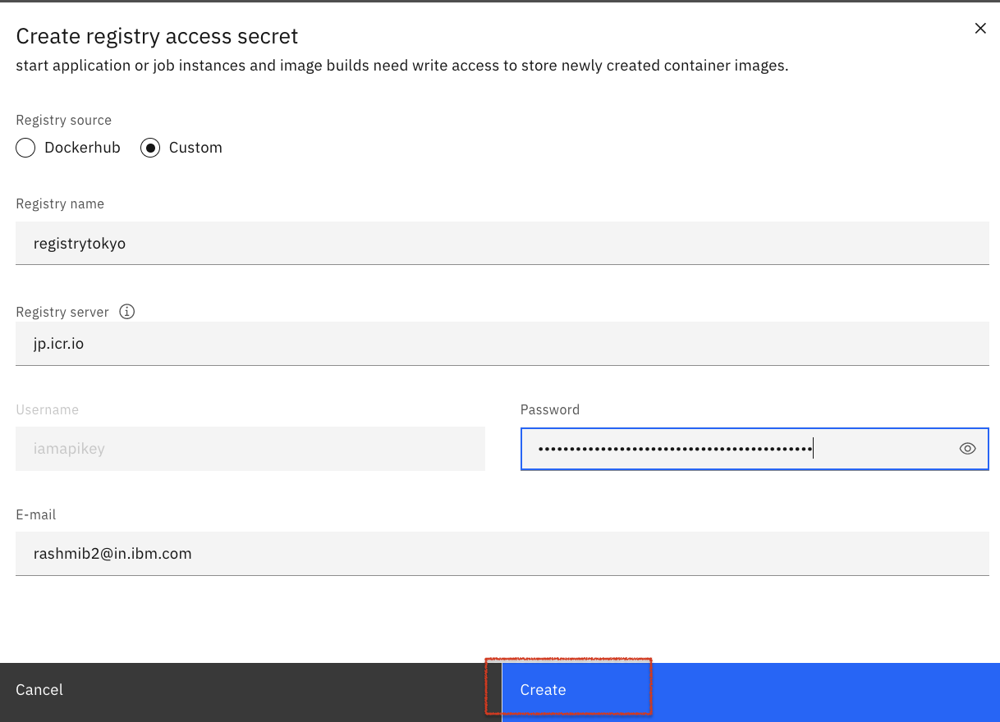
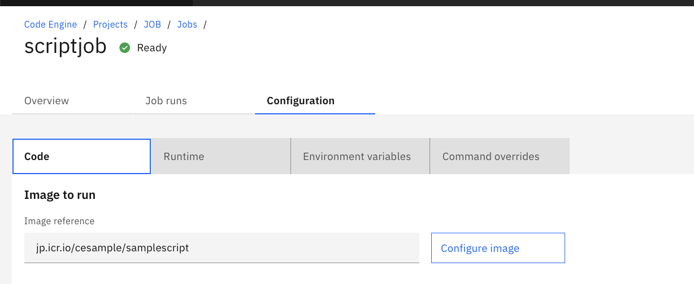
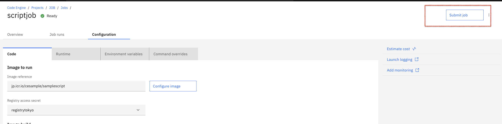
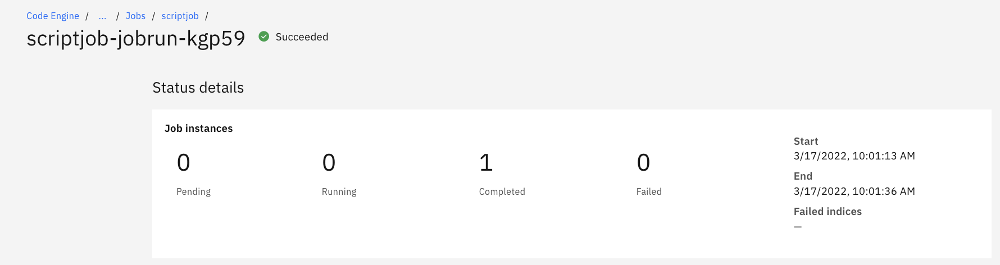
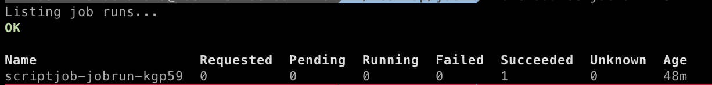
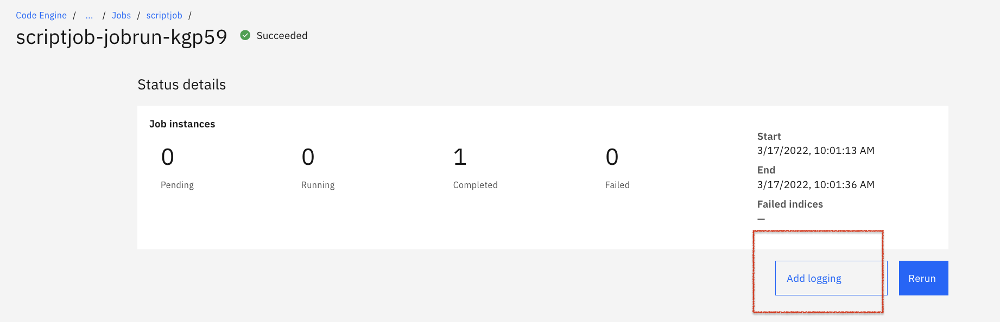
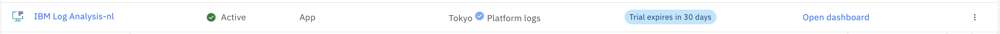
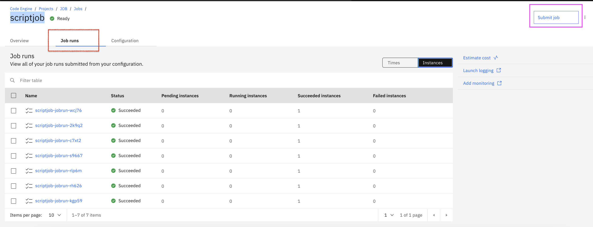
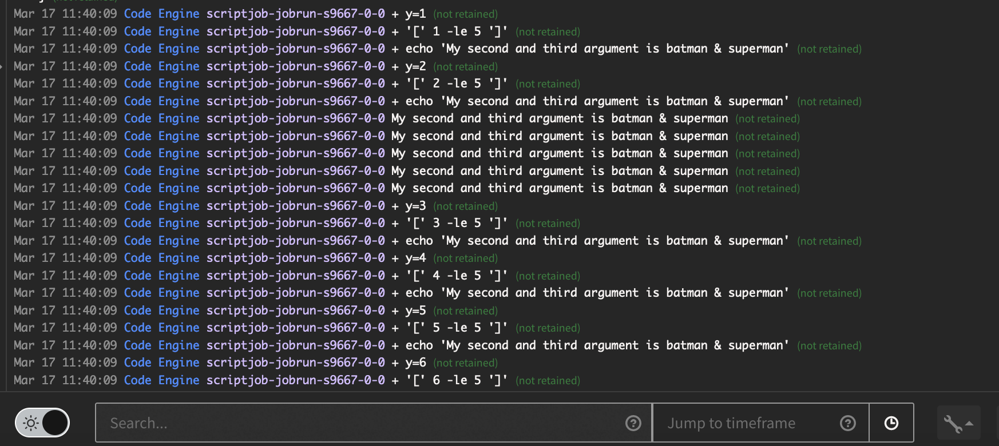

# Troubleshooting the IBM Cloud Code Engine batch job 

**What is a batch job?**

A batch job is a scheduled program that is assigned to run on a computer without further user interaction.
Batch jobs are frequently used to automate tasks that need to be performed on a regular basis.
Jobs are designed to run one time and exit.

# Architecture

1. Building the container image based on the provided Dockerfile.
2. Push the newly built container images to the IBM Cloud Container Registry.
3. Create and submit the Code Engine job by using the container image.

# Steps

1. Prerequisites
2. Create Dockerfile and run
3. Building the container image 
4. Create and submit the Job
5. Troubleshooting the Job
6. Integrate the logging capability

## 1. Prerequisites

You need the following:

* [IBM Cloud account](https://cloud.ibm.com/registration)
* [IBM Cloud CLI](https://cloud.ibm.com/docs/cli?topic=cli-getting-started)
* [Docker Engine](https://cloud.ibm.com/docs/Registry?topic=Registry-getting-started#gs_registry_images_pulling)

## 2. Create Dockerfile and run 

Locally, launch the terminal:

* Create a directory : mkdir job

* Change the Directory : cd job

* Create a script.sh file and copy the following contents.

 * vi script.sh

            
            #!/bin/bash
            set -x
            y=1
            while [ $y -le 5 ]
            do
                echo "The first and second arguments are $1 & $2"
                y=$(( $y + 1 ))	
            done
            
  
Note: You should have the script.sh in the same folder where you have the Dockerfile. 
  
* Create the Dockerfile with the following contents which copy the script to the container and runs it part of the ENTRYPOINT using the arguments from CMD. 
  
            
            FROM centos:7
            MAINTAINER Devopscube
            RUN yum -y update && \
                yum -y install httpd && \
                yum clean all
            COPY ./script.sh /
            RUN chmod +x /script.sh
            ENTRYPOINT ["/script.sh"]
            CMD ["batman", "superman"]
            

 * Lets build this Dockerfile with the image name script-demo.
    
            docker build -t _image-name_ _directory_
           
            docker build -t script-demo .
           
 * List images.
             
             docker images
             
 * Now lets create a container named demo using script-demo image.
     
              docker run --name demo -d script-demo
            
 * You can check the container logs using the following command.
      
            docker logs demo -f   
            
    You see the below output
    
            My second and third argument is batman & superman
            My second and third argument is batman & superman
            My second and third argument is batman & superman
            My second and third argument is batman & superman
            My second and third argument is batman & superman
            + y=1
            + '[' 1 -le 5 ']'
            + echo 'My second and third argument is batman & superman'
            + y=2
            + '[' 2 -le 5 ']'
            + echo 'My second and third argument is batman & superman'
            + y=3
            + '[' 3 -le 5 ']'
            + echo 'My second and third argument is batman & superman'
            + y=4
            + '[' 4 -le 5 ']'
            + echo 'My second and third argument is batman & superman'
            + y=5
            + '[' 5 -le 5 ']'
            + echo 'My second and third argument is batman & superman'
            + y=6
            + '[' 6 -le 5 ']'
            
 ## 3. Building the container image 

 * Create Namespace in Container Registry:

 * Navigate to https://cloud.ibm.com/registry/namespaces
 
 * Switch to a Location say Tokyo
   
 * Create a namespace "cesample"

 * Tag the image

            docker tag script-demo:latest jp.icr.io/cesample/samplescript:latest

 * Log in to the IBM Cloud Container Registry 

            ibmcloud cr region-set jp.icr.io

 * Docker image push to share your images to the registry

            docker push jp.icr.io/cesample/samplescript:latest

 * To ensure the image is created:

            ibmcloud cr images

* The image created gets listed here:  https://cloud.ibm.com/registry/images

* To add registry access to Code Engine, we have to create an API key 

   * Navigate to https://cloud.ibm.com/iam/apikeys

   * Click Create an IBM Cloud API key.
   
   * Enter a name and optional description for your API key and click Create.
   
   * Copy the API key or click download to save it.

      Ex:

      Name: registrytokyo

      API key: CoDKpQraJN94KeF5bvx6d_Y9FWiW8sbKA49lcp9Il4Sw

      yA_8lDJHqxLM5HfpeZ0wtVqL1QazUgFficD-lkj3_YA9

* Create a project

  * Navigate to https://cloud.ibm.com/codeengine/projects . 

  * Select a project from the list of available projects. You can also create a new one. Note that you must have a selected project to create a job.

  * Let's create a new one.Choose a location to deploy the project say Tokyo .

  * Enter a name for the project say JOB. The name must be unique for all your projects within the specified location.

  * Choose the resource group say App where you want to create the project.

  * Click Create.

  * On the Overview page of Project JOB, click create Job. Provide the name say 'scriptjob'.

   * Choose the code to run where the container image radio button is selected. 
   
   * Provide the image reference as  jp.icr.io/cesample/samplescript:latest and click configure image
   
   * Click [Registry access secret](https://cloud.ibm.com/docs/codeengine?topic=codeengine-add-registry#add-registry-access-ce) 

     

   * Click Done.

   * Create Job.
     
     
     

   * Submit Job.

     
 
     
   * The job is successful

           

     
# Accessing job details with the CLI  

   * ibmcloud login --sso
   
   * ibmcloud target -g _ResourceGroup_   ex:  ibmcloud target -g App

   * ibmcloud ce project list
   
   * ibmcloud ce project select --name _Jobname_   ex:   ibmcloud ce project select --name JOB
   
   * ibmcloud ce jobrun list
   
  

   * ibmcloud ce jobrun get --name scriptjob-jobrun-kgp59
   
   * Run 'ibmcloud ce jobrun events -n scriptjob-jobrun-kgp59' to get the system events of the job run instances.

   * Run 'ibmcloud ce jobrun logs -f -n scriptjob-jobrun-kgp59' to follow the logs of the job run instances.
   

   * For more details and documentation on the Code Engine CLI, go [here](https://cloud.ibm.com/docs/codeengine?topic=codeengine-cli).

To [view logs](https://cloud.ibm.com/docs/codeengine?topic=codeengine-view-logs#view-logs-ui) for an app or a job in the Code Engine console, you must create an IBM Log Analysis instance in the same region as your Code Engine project. 

Code Engine makes it easy to enable logging for your apps and jobs.

If you have previously created a Log Analysis instance, launch logging displays and you do not need to complete this step.

Click Add logging to create the IBM Log Analysis instance. 

Say location: Tokyo

Resource group: App

You can select Lite Plan and then create

From your Code Engine jobrun page, click Configure logging.Select the newly created Log Analysis instance in the prior step. Click Select to receive platform logs.

Now that platform logging is configured from your Code Engine app page, click Launch logging to open your platform logs window. 

Under Observability dashboard, instance can be seen.

https://cloud.ibm.com/observe/logging

From your Code Engine scriptjob, click Submit job.

Job runs : View all of your job runs submitted from your configuration.

You can view platform logs in the platform logs window.

You have completed the steps to configure your Log Analysis instance such that it can receive platform logging for your Code Engine job.

Alternatively, you can also configure a Log Analysis instance by using the Observability dashboard to create the instance, and then by configuring platform logs. After you create your instance, click Configure platform logs. Select the Log Analysis instance to receive the platform log data by specifying a region and your log instance.

# CONGRATULATIONS!
Kudos to you! You have learned how to run jobs in IBM Cloud Code Engine.

